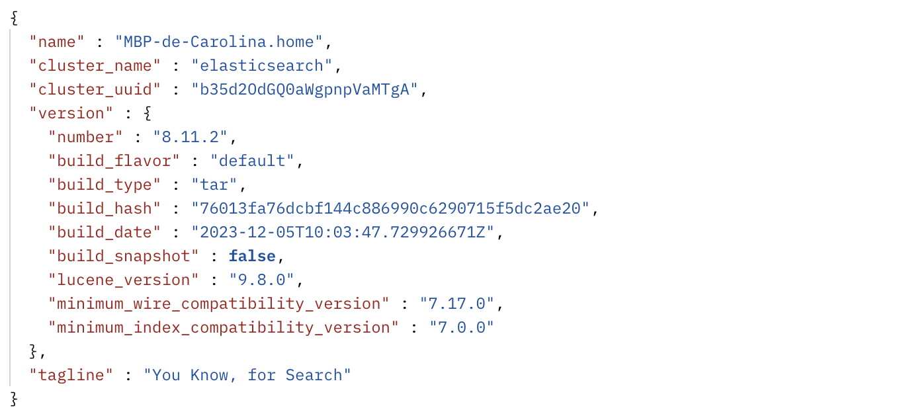

## Application Structure

### Overview

The application is structured into two major components: the server component and the client component. The server component is responsible for data access, manipulation, storage, handling HTTP requests and responses, and managing internal errors. The client component handles client interactions such as user login and signup.

### Modules

1. Server Entry Point - seca-server.mjs:

The main entry point of the server application, seca-server.mjs, manages the server routes. It acts as a traffic controller, directing incoming requests to the appropriate modules for processing. 

2. Web API Communication - seca-web-api:

The seca-web-api module facilitates communication between the client and server through JSON responses. Services are accessible without a graphical interface, which helps fast communication between client and server. 

3. User Interface - seca-web-site:

The user interface is handled by seca-web-site. The use of HandleBars formatting language allows dynamic content, while CSS ensures a visually appealing experience. This module prioritizes simplicity and efficiency in displaying essential information to users.

4. API services - seca-services:

seca-services.mjs is dedicated to implement all the API available services. Is the bridge between the server and data storage/database. It plays a critical role in ensuring the reliability of the server by throwing exceptions and checking each request before storing data. 

5. TM API Integration - tm-events-data:

The tm-events-data module communicates with the TicketMaster API, allowing the application to retrieve events details, search for specific events by name, and display popular events.

6. Elastic Database Management - seca-data-elastic:

The seca-data-elastic module serves as the foundation for tracking individual user information, managing the addition and removal of groups and events, and updating group information. It also handles user credentials for validation and registration.

7. User Authentication and Authorization - seca-users-web-site.mjs:

Handling all login and signup actions, the seca-users-web-site.mjs module is responsible for user authentication and authorization. It grants authorized users access to their individual information and enables actions such as adding or removing groups and events. 


## Data Storage Design

For data storage was used ElasticSearch database, organized in 2 indices:

### Users

The user index serves as the repository for all user-related data, including username, password, userId, and token. When creating a new user, the system checks the chosen username to ensure that it is unique. A new user is then added to the database. During the login process, the system utilizes the _search method to verify the existence of a user with matching credentials (username and password) before granting access. 

> Users storage

- **id** internal identifier for user
- **username** identfier chosed by the user
- **password** user authenticator
- **email** user's email
- **token** random UUID

### Groups

The groups index stores data related to each group, including name, description, events, user_Id, groupId, and token. The user_Id within the group information is crucial as it establishes the relationship between a user and their groups. To remove a event from a group, a script is executed to delete the event from the events array within the group, simplifying the data structure. 

> Groups storage

- **id** internal identifier for group
- **name** group name
- **description** group description
- **userId** identifier of the user that owns the group
- **events** array with all the added events to the group

##### Side note: 
On the first stage of the API implementation, the module data-local was responsable for storing data regarding groups, users and TM queries in a local environment. The storage was implemented using arrays to store the different objects.


## API Documentation

```yaml
openapi: 3.0.1
info:
  title: SECA API
  description: This is a API for managing events
  contact:
    email: a49465&49462@alunos.isel.pt
  license:
    name: Apache 2.0
    url: http://www.apache.org/licenses/LICENSE-2.0.html
  version: 1.0.0
servers:
  - description: Localhost server for testing API
    url: http://localhost:8080/

tags:
  - name: Events
  - name: Users
  - name: Groups
paths:
  /events:
    get:
      tags:
        - Events
      summary: Search Events
      description: Search events associated with a keyword
      operationId: getSearchedEvents
      parameters:
        - name: keyword
          in: query
          description: Query to match in event title
          schema:
            type: string
          required: true
        - name: size
          in: query
          description: Number of events per page (page size)
          schema:
            minimum: 1
            default: 30
            type: integer
          required: false
        - name: page
          in: query
          description: Page Number
          schema:
            minimum: 0
            default: 1
            type: integer
          required: false
      responses:
        200:
          description: Related events received
          content:
            application/json:
              schema:
                type: array
                items:
                $ref: "#/components/schemas/Events"
        400:
          description: Missing parameter in query
          $ref: "#/components/responses/400BadRequest"
  /events/popular:
    get:
      tags:
        - Events
      summary: Get Most Popular Events
      description: Lists most popular events, according to page number and size
      operationId: getPopularEvents
      parameters:
        - name: s
          in: query
          description: Number of events per page (page size)
          schema:
            minimum: 1
            default: 30
            type: integer
          required: false
        - name: p
          in: query
          description: Page Number
          schema:
            minimum: 0
            default: 1
            type: integer
          required: false
      responses:
        200:
          description: Most popular events received
          content:
            application/json:
              schema:
                type: array
                items:
                  $ref: "#/components/schemas/Events"
        400:
          description: Invalid parameter
          $ref: "#/components/responses/400BadRequest"
  /users:
    post:
      tags:
        - Users
      summary: Add User
      description: Adds a user to the system
      operationId: createUser
      security: []
      requestBody:
        description: User to add
        content:
          application/json:
            schema:
              $ref: "#/components/schemas/NewUser"
        required: true
      responses:
        201:
          description: New user was created
          content:
            application/json:
              schema:
                $ref: "#/components/schemas/User"
        400:
          description: User already exists
          content:
            application/json:
              schema:
                $ref: "#/components/responses/400UserExists"
  /groups:
    get:
      tags:
        - Groups
      summary: Gets All Groups
      description: Lists all existing groups
      operationId: getGroups
      security:
        - Token: []
      responses:
        200:
          description: Get all groups of user
          content:
            application/json:
              schema:
                $ref: "#/components/schemas/Groups"
        404:
          description: Invalid user
          $ref: "#/components/responses/404UserNotFound"
    post:
      tags:
        - Groups
      summary: Add New Group
      description: Adds a group to the system
      operationId: createGroup
      security:
        - Token: []
      requestBody:
        description: Group to add with name and description
        content:
          application/json:
            schema:
              $ref: "#/components/schemas/Group"
        required: true
      responses:
        201:
          description: Group created
          content:
            application/json:
              schema:
                $ref: "#/components/schemas/NewGroup"
        404:
          description: Invalid user
          $ref: "#/components/responses/404UserNotFound"
  /groups/{groupId}:
    get:
      tags:
        - Groups
      summary: Get Group
      description: Get a group by its id
      operationId: getGroupsDetails
      security:
        - Token: []
      parameters:
        - name: groupId
          in: path
          description: ID of group to be fetched
          required: true
          schema:
            type: integer
            minimum: 0
      responses:
        200:
          description: Group exists and belongs to user
          content:
            application/json:
              schema:
                $ref: "#/components/schemas/GroupDetails"
        404:
          description: Invalid User/Invalid Group
          content:
            application/json:
              schema:
                oneOf:
                  - $ref: "#/components/responses/404UserNotFound"
                  - $ref: "#/components/responses/404GroupNotFound"
              examples:
                404UserNotFound:
                  summary: "User Not Found"
                  value:
                    code: 2
                    error: "User Not Found"
                404GroupNotFound:
                  summary: "Group Not Found"
                  value:
                    code: 3
                    error: "Group with id 4 not found"
        401:
          description: Group does not belong to user
          $ref: "#/components/responses/401Unauthorized"
    put:
      tags:
        - Groups
      summary: Update Group
      description: Updates name and description of a group
      operationId: updateGroup
      security:
        - Token: []
      parameters:
        - name: groupId
          in: path
          description: ID of group to be updated
          required: true
          schema:
            type: integer
            minimum: 0
      requestBody:
        description: Group to update
        content:
          application/json:
            schema:
              $ref: "#/components/schemas/Group"
        required: true
      responses:
        201:
          description: group updated
          content: 
            application/json:
              schema:
                $ref: "#/components/schemas/GroupDetails"
              example: 
                status: "SUCESS"
                group:
                    groupId: 1
                    nameGroup: "SECA GROUP"
                    description: "Developing SECA API"
                    events: 
                      - id: Z7r9jZ1AdOvF0
                        name: Miami Hurricanes Football vs. Ball State Cardinals Football
                        date: 2024-09-14
                        segment: Sports
                        genre: Football
                        url: https://www.ticketmaster.com/event/Z7r9jZ1AdOvF0
        401:
          description: Group does not belong to user
          $ref: "#/components/responses/401Unauthorized"
        404:
          description: Invalid User/Invalid Group
          content:
            application/json:
              schema:
                oneOf:
                  - $ref: "#/components/responses/404UserNotFound"
                  - $ref: "#/components/responses/404GroupNotFound"
                  - $ref: "#/components/responses/404EventNotFound"
              examples:
                404UserNotFound:
                  summary: "User Not Found"
                  value:
                    code: 2
                    error: "User Not Found"
                404GroupNotFound:
                  summary: "Group Not Found"
                  value:
                    code: 3
                    error: "Group with id 4 not found"
    delete:
      tags:
        - Groups
      summary: Delete Group
      description: Delete a group given its ID
      operationId: deleteGroup
      security:
        - Token: []
      parameters:
        - name: groupId
          in: path
          description: ID of the group to be deleted
          required: true
          schema:
            type: integer
      responses:
        200:
          description: "Group successfully deleted"
          content: 
            application/json:
              schema:
                $ref: "#/components/schemas/GroupDetails"
              example: 
                status: "SUCESS"
                group:
                    groupId: 1
                    nameGroup: "SECA GROUP"
                    description: "Developing SECA API"
                    events: 
                      - id: Z7r9jZ1AdOvF0
                        name: Miami Hurricanes Football vs. Ball State Cardinals Football
                        date: 2024-09-14
                        segment: Sports
                        genre: Football
                        url: https://www.ticketmaster.com/event/Z7r9jZ1AdOvF0
        401:
          description: Group does not belong to user
          $ref: "#/components/responses/401Unauthorized"
        404:
          description: Invalid User/Invalid Group
          content:
            application/json:
              schema:
                oneOf:
                  - $ref: "#/components/responses/404UserNotFound"
                  - $ref: "#/components/responses/404GroupNotFound"
              examples:
                404UserNotFound:
                  summary: "User Not Found"
                  value:
                    code: 2
                    error: "User Not Found"
                404GroupNotFound:
                  summary: "Group Not Found"
                  value:
                    code: 3
                    error: "Group with id 4 not found"
  /groups/{groupId}/events:
    post:
      tags:
        - Groups
      summary: Add Event To Group
      description: Adds event to group by id
      operationId: addGroupEvents
      security:
        - Token: []
      parameters:
        - name: eventId
          in: query
          required: true
          schema:
            type: string
            minimum: 0
        - name: groupId
          in: path
          description: ID of group that to be fetched
          required: true
          schema:
            type: integer
            minimum: 0
      responses:
        201:
          description: Event added successfully
          content:
            application/json:
              schema:
                $ref: "#/components/schemas/Groups"
              example:
                status: "SUCESS"
                groups:
                  - id: 2
                    name: "Grupo 2"
                    description: "Group 2 description"
                    userId: 0
                    events:
                      - id: vvG1fZ9nSQC9Zk
                        name: Disney On Ice presents Into the Magic
                        date: 2024-01-21
                        time: 15:00:00
                        segment: Miscellaneous
                        genre: Ice Shows
                        url: https://www.ticketmaster.com/disney-on-ice-presents-into-the-indianapolis-indiana-01-21-2024/event/05005EACDA397006
                      - id: G5vHZ9m35D8BG
                        name: Depeche Mode
                        date: 2024-01-29
                        time: 19:30:00
                        segment: Music
                        genre: Rock
                        url: https://www.ticketmaster.co.uk/depeche-mode-manchester-29-01-2024/event/1F005EE48BED0E8C
                  - id: 8
                    name: "Grupo 8"
                    description: "Group 8 description"
                    userId: 0
                    events: 
                      - id: vvG1bZ9c96xJq-
                        name: Christmas With Elvis
                        date: 2023-12-1
                        time: 19:30:00
                        segment: Music
                        genre: Other
                        url: https://www.ticketmaster.com/christmas-with-elvis-burnsville-minnesota-12-13-2023/event/06005ED5C78A6761
        400:
          description: Event already exists in group
          $ref: "#/components/responses/400EventExists"
        401:
          description: Group does not belong to user
          $ref: "#/components/responses/401Unauthorized"
        404:
          description: Invalid User/Invalid Group/Invalid Event
          content:
            application/json:
              schema:
                oneOf:
                  - $ref: "#/components/responses/404UserNotFound"
                  - $ref: "#/components/responses/404GroupNotFound"
                  - $ref: "#/components/responses/404EventNotFound"
              examples:
                404UserNotFound:
                  summary: "User Not Found"
                  value:
                    code: 2
                    error: "User Not Found"
                404GroupNotFound:
                  summary: "Group Not Found"
                  value:
                    code: 3
                    error: "Group with id 4 not found"
                404EventNotFound:
                  summary: "Event Not Found"
                  value:
                    code: 6
                    error: "Event with id Z7r9jZ1AdJ9 not found"
  /groups/{groupId}/events/{eventsId}:
    delete:
      tags:
        - Groups
      summary: Remove Event From Group
      description: Remove event by its Id from a group by its Id as well
      operationId: getGroupEvent
      security:
        - Token: []
      parameters:
        - name: groupId
          in: path
          description: ID of group that to be fetched
          required: true
          schema:
            type: integer
            minimum: 0
        - name: eventId
          in: path
          description: ID of event that to be fetched
          required: true
          schema:
            type: string
      responses:
        200:
          description: "Group successfully deleted"
          content: 
            application/json:
              schema:
                $ref: "#/components/schemas/Group"
              example:
                status: "SUCESS"
                groups:
                  id: Z7r9jZ1AdJ9uK
                  name: New Orleans Pelicans vs. Phoenix Suns
                  date: 2024-01-19
                  time: 19:00:00
                  segment: Sports
                  genre: Basketball
                  url: https://www.ticketmaster.com/event/Z7r9jZ1AdJ9uK
        401:
          description: Group does not belong to user
          $ref: "#/components/responses/401Unauthorized"
        404:
          description: Invalid User/Invalid Group/Invalid Event
          content:
            application/json:
              schema:
                oneOf:
                  - $ref: "#/components/responses/404UserNotFound"
                  - $ref: "#/components/responses/404GroupNotFound"
                  - $ref: "#/components/responses/404EventNotFound"
              examples:
                404UserNotFound:
                  summary: "User Not Found"
                  value:
                    code: 2
                    error: "User Not Found"
                404GroupNotFound:
                  summary: "Group Not Found"
                  value:
                    code: 3
                    error: "Group with id 4 not found"
                404EventNotFound:
                  summary: "Event Not Found"
                  value:
                    code: 6
                    error: "Event with id Z7r9jZ1AdJ9 not found"
components:
  securitySchemes:
    Token:
      type: http
      scheme: bearer
      bearerFormat: string
  schemas:
    Events:
      allOf:
        - $ref: "#/components/schemas/Events"
        - type: array
          example:
            - id: G5v0Z9Yc3JYMI
              name: Phoenix Suns vs. Sacramento Kings
              date: 2024-02-13
              time: 20:00:00
              segment: Sports
              genre: Basketball
              url: https://www.ticketmaster.com/phoenix-suns-vs-sacramento-kings-phoenix-arizona-02-13-2024/event/19005F0B529B0DE8
            - id: G5dIZ9YmSXKWz
              name: San Antonio Spurs vs. Phoenix Suns
              date: 2024-03-25
              time: 19:00:00
              segment: Sports
              genre: Basketball
              url: https://www.ticketmaster.com/san-antonio-spurs-vs-phoenix-suns-san-antonio-texas-03-25-2024/event/3A005F0BB3F93F78
    NewUser:
      allOf:
        - $ref: "#/components/schemas/NewUser"
        - type: object
          required:
            - username
          properties:
            username:
              type: string
              example: Alberto
    User:
      allOf:
        - $ref: "#/components/schemas/User"
        - type: object
          properties:
            status:
              type: string
              example: "SUCESS"
            newUser:
              type: object
              example:
                - id: 2
                  name: "Alberto"
                  token: "d86dc4c0-c3c5-46ec-a489-2ce22608e254"
    Groups:
      allOf:
        - $ref: "#/components/schemas/Groups"
        - type: object
          required:
            - groupId
          properties:
            status:
              type: string
              example: "SUCESS"
            groups:
              type: array
              example:
                - id: 2
                  name: "Grupo 2"
                  description: "Group 2 description"
                  userId: 0
                  events:
                    - id: vvG1fZ9nSQC9Zk
                      name: Disney On Ice presents Into the Magic
                      date: 2024-01-21
                      time: 15:00:00
                      segment: Miscellaneous
                      genre: Ice Shows
                      url: https://www.ticketmaster.com/disney-on-ice-presents-into-the-indianapolis-indiana-01-21-2024/event/05005EACDA397006
                    - id: G5vHZ9m35D8BG
                      name: Depeche Mode
                      date: 2024-01-29
                      time: 19:30:00
                      segment: Music
                      genre: Rock
                      url: https://www.ticketmaster.co.uk/depeche-mode-manchester-29-01-2024/event/1F005EE48BED0E8C
                - id: 8
                  name: "Grupo 8"
                  description: "Group 8 description"
                  userId: 0
                  events: []
    GroupDetails:
      allOf:
        - $ref: "#/components/schemas/GroupDetails"
        - type: object
          required:
            - groupId
          properties:
            status:
              type: string
              example: "SUCESS"
            group:
              type: object
              example:
                groupId: 1
                nameGroup: "Football events"
                description: "This group is only for football events"
                events: 
                  - id: Z7r9jZ1AdOvF0
                    name: Miami Hurricanes Football vs. Ball State Cardinals Football
                    date: 2024-09-14
                    segment: Sports
                    genre: Football
                    url: https://www.ticketmaster.com/event/Z7r9jZ1AdOvF0
    NewGroup:
      type: object
      properties:
        status:
          type: string
          example: SUCCESS
        newGroup:
          type: object
          example:
            id: 6
            name: "SECA GROUP"
            description: "Developing SECA API"
            userId: 0
            events: []
    Group:
      required:
        - name
        - description
      type: object
      properties:
        name:
          type: string
          example: "SECA GROUP"
        description:
          type: string
          example: "Developing SECA API"
    NewGroupEvent:
      allOf:
        - $ref: "#/components/schemas/NewGroupEvent"
        - type: object
          required:
            - eventId
          properties:
            id:
              type: integer
              example: 1
    MissingParameter:
      type: object
      properties:
        error:
          type: string
          example: "Missing required parameter"
    InvalidBody:
      type: object
      properties:
        error:
          type: string
          example: "Invalid body content"
  responses:
    400BadRequest:
      description: "Missing parameter"
      content:
        application/json:
          schema:
            type: object
            properties:
              code: 
                type: integer
                example: 1
              error:
                type: string
                example: "Invalid parameter"
    400EventExists:
      description: "Event already exists in group"
      content:
        application/json:
          schema:
            type: object
            properties:
              code:
                type: integer
                example: 5
              error:
                type: string
                example: "Event with id vvG1fZ9nSQC9Zk already exists`"
    400UserExists:
      description: "User already exists"
      content:
        application/json:
          schema:
            type: object
            properties:
              code: 
                type: integer
                example: 7
              error:
                type: string
                example: "User with username Carolina already exists"
    401Unauthorized:
      description: "Lack of valid token"
      content:
        application/json:
          schema:
            type: object
            properties:
              code: 
                type: integer
                example: 4
              error:
                type: string
                example: "Not Authorized"
    404UserNotFound:
      description: "User not found"
      content:
        application/json:
          schema:
            type: object
            properties:
              code:
                type: integer
                example: 2
              error:
                type: string
                example: "User Not Found"
    404GroupNotFound:
      description: "Group not found"
      content:
        application/json:
          schema:
            type: object
            properties:
              code:
                type: integer
                example: 3
              error:
                type: string
                example: "Group with id 4 not found"
    404EventNotFound:
      description: "Event not found"
      content:
        application/json:
          schema:
            type: object
            properties:
              code:
                type: integer
                example: 6
              error:
                type: string
                example: "Event with id Z7r9jZ1AdJ9 not found"
```


## How to run

- In the interest of runnig the application, there are some plugins that may need to be installed. First run the following commands:

```
npm init
npm install express
npm install express-session
npm install url
npm install cors
npm install hbs
npm install passport
npm install swagger-ui-express
npm install yamljs
npm install path
npm install morgan
npm install express-session
npm install cookie-parser
npm install body-parser
npm install mocha
```

- In `package.json` file, add the following parameter:

```json
"scripts": {
    "test": "mocha",
    "start": "node ./code/seca-server.mjs",
    "start-dev": "nodemon ./code/seca-server.mjs"
}
```

- Before launching the server, you need to install [ElasticSearch](https://www.elastic.co/pt/elasticsearch) database.

- After the previous is complete, go to location of the **elasticsearh** folder, and open a command line inside the folder. Then, execute the following command `bin/elasticsearch` in order to run it in your machine. To test your connection to the database use [Postman](https://www.postman.com) or use a browser of your choice and make a request to this URI http://localhost:9200. If your response is similar to the following, then your is elasticsearch is running.



## Launch Server

### Deployment mode

`npm run start`

### Development mode

`npm run start-dev`
